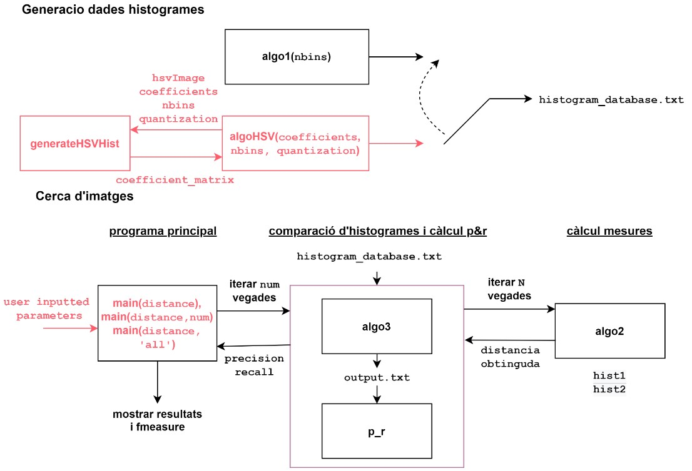

# Projecte PIV (Processament d'imatge i vídeo)
Aquest repositori conté una implementació en Matlab de cerca d'imatges utilitzant SCD (Scalable Color Descriptor). La descripció en detall de l'algorisme i resultats es troben en el document Memoria.

A continuació es mostra el diagrama del sistema.

